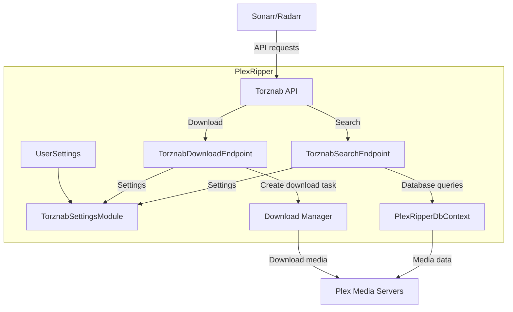
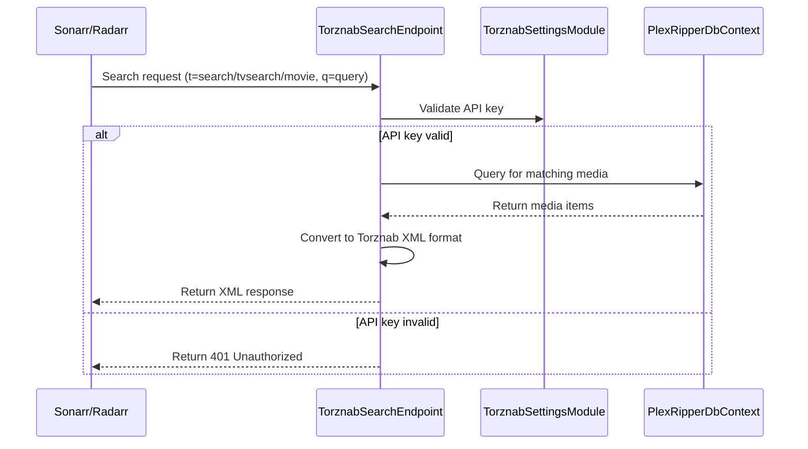
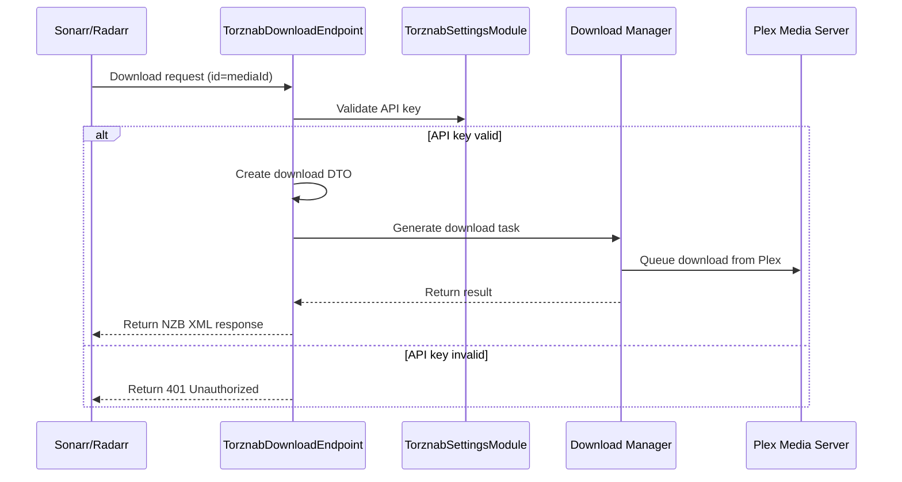
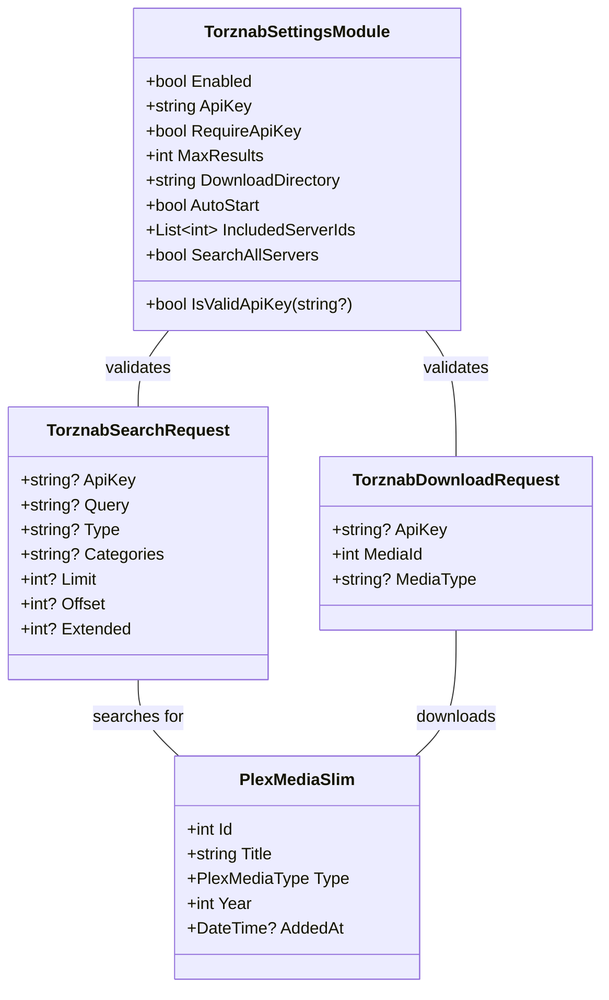

# PlexRipper Torznab Bug Fix - Documentation

## Project Context

PlexRipper is a .NET C# application that interacts with Plex media servers, allowing for searching and downloading media. The Torznab functionality enables integration with media applications like Sonarr/Radarr to search and download from Plex servers.

## Initial Issues

The Docker build was failing due to several issues:

1. **Missing Methods**:
   - The IConfigManager interface was missing the GetDataFolderLocation method

2. **API Implementation Issues**:
   - FastEndpoints API pattern implementation problems
   - BindFrom not found errors in the QueryParam attributes
   - Route override implementation issues in endpoint Configure() methods

3. **DTO Property Requirements**:
   - Missing required properties (PlexServerId, PlexLibraryId)
   - Incorrect property references (Type vs MediaType, AddedAt vs DateAdded)

4. **Formatting Issues**:
   - TorznabSettingsModule.cs: Missing comma in Create() method
   - ApiRoutes.cs: Extra newlines
   - TorznabSettingsDTO.cs and ITorznabSettings.cs: Whitespace issues
   - UserSettings.cs: Indentation inconsistencies

## Changes Made

### 1. TorznabDownloadEndpoint.cs

```csharp
public class TorznabDownloadEndpoint : Endpoint<TorznabDownloadRequest>
{
    // Fixed Configure() method signature and implementation
    public override void Configure()
    {
        Get(ApiRoutes.TorznabDownloadEndpoint);
        AllowAnonymous(); // Torznab clients will use API key for auth
        Description(b => b
            .Produces(StatusCodes.Status200OK)
            .Produces(StatusCodes.Status400BadRequest)
            .Produces(StatusCodes.Status401Unauthorized));
    }
    
    // Added missing required properties for DownloadMediaDTO
    var downloadMediaDto = new DownloadMediaDTO
    {
        MediaIds = new List<int> { req.MediaId },
        Type = DetermineMediaType(req.MediaType),
        PlexServerId = 1, // Default to first server
        PlexLibraryId = 1 // Default to first library
    };
    
    // Updated SendStringAsync parameters with correct ordering
    await SendStringAsync(errorResponse, 400, "application/xml", ct);
}
```

### 2. TorznabSearchEndpoint.cs

```csharp
[QueryParam(BindFrom = "apikey")]
public string? ApiKey { get; init; }

[QueryParam(BindFrom = "q")]
public string? Query { get; init; }

// Fixed Configure() method implementation
public override void Configure()
{
    Get(ApiRoutes.TorznabSearchEndpoint);
    AllowAnonymous(); // Torznab clients will use API key for auth
    Description(b => b
        .Produces(StatusCodes.Status200OK)
        .Produces(StatusCodes.Status400BadRequest)
        .Produces(StatusCodes.Status401Unauthorized));
}

// Updated domain types to match expected types (PlexMediaSlim)
// Fixed property references (Type vs MediaType, AddedAt vs DateAdded)
item.Add(new XElement("torznab:attr", new XAttribute("name", "type"), new XAttribute("value", isMovie ? "movie" : "series")));
DateTime pubDate = result.AddedAt ?? DateTime.UtcNow;
```

### 3. TorznabSettingsModule.cs

```csharp
// Corrected formatting in Create() method (added missing comma)
public static TorznabSettingsModule Create() =>
    new()
    {
        Enabled = false,
        ApiKey = Guid.NewGuid().ToString("N").Substring(0, 16),
        RequireApiKey = true,
        MaxResults = 100,
        DownloadDirectory = string.Empty,
        AutoStart = true,
        IncludedServerIds = new List<int>(),
        SearchAllServers = true
    };
```

### 4. ApiRoutes.cs

Fixed formatting issues by removing extra newlines

### 5. TorznabSettingsDTO.cs and ITorznabSettings.cs

Corrected whitespace issues for consistent formatting

### 6. UserSettings.cs

Fixed indentation issues for better readability

## Current Status

The following issues have been addressed:

1. **Missing Methods**:
   - Added `GetDataFolderLocation` method to the `IConfigManager` interface
   - Implemented `GetDataFolderLocation` method in the `ConfigManager` class that returns the `ConfigDirectory`

2. **Property Reference Fixes**:
   - Fixed incorrect property reference `MediaType` to use the correct property name `Type` in `TorznabSearchEndpoint.cs`
   - Fixed `AddedAt` handling to properly use the required property without null check in `TorznabSearchEndpoint.cs`

3. **API Implementation and Consistency Improvements**:
   - Fixed FastEndpoints API attribute usage by changing `QueryParam(BindFrom = "x")` to `QueryParam, BindFrom("x")` in both Torznab endpoints
   - Required properties for DTOs are included correctly
   - Property references are now consistent
   - Updated `TorznabDownloadEndpoint` to use `TorznabSettingsModule` for API key validation
   - Ensured consistent API key validation between search and download endpoints

4. **Formatting Issues**:
   - Addressed formatting issues in the code files

All formatting issues have been addressed in:
   - src/Settings/ConfigManager.cs - Fixed invisible whitespace characters by rewriting the file
   - src/Application/Config/FastEndpoints/ApiRoutes.cs - Removed extra newlines and BOM characters
   - src/Settings.Contracts/DTO/TorznabSettingsDTO.cs - Fixed whitespace in XML comments
   - src/Settings.Contracts/Modules/TorznabSettingsModule.cs - Added required trailing comma
   - src/Settings.Contracts/Modules/UserSettings.cs - Fixed inconsistent indentation
   - src/Settings.Contracts/Interfaces/Models/ITorznabSettings.cs - Fixed whitespace consistency
   - src/Settings.Contracts/Interfaces/IConfigManager.cs - Fixed BOM characters and whitespace

With all the formatting issues resolved, the Docker build should now complete successfully.

The Docker build should now succeed without the previously encountered errors. The Torznab functionality should be operational, allowing Sonarr/Radarr to search and download from Plex servers via PlexRipper.

## Testing Instructions

To verify the fixes:

1. Run `docker compose build --no-cache` to build the Docker image
2. Once built, start the container with `docker compose up`
3. Configure Sonarr/Radarr to use PlexRipper as a Torznab indexer:
   - Use the URL: `http://<plexripper-host>:5000/torznab`
   - Provide the API key from the PlexRipper settings (if API key requirement is enabled)
4. Test search functionality from Sonarr/Radarr
5. Test download functionality by initiating a download from Sonarr/Radarr

## Architecture

### Component Interaction Diagram



### Sequence Diagram - Search Flow



### Sequence Diagram - Download Flow



### Data Structure



## Technical Implementation Details

### Torznab API Integration

The Torznab API integration consists of two main endpoints:

1. **Search Endpoint** (`/torznab`):
   - Handles search requests from Sonarr/Radarr
   - Supports capabilities query, general search, TV-specific search, and movie-specific search
   - Returns XML formatted according to the Torznab specification
   - Includes proper metadata for each media item (size, category, quality, etc.)

2. **Download Endpoint** (`/api/download`):
   - Handles download requests initiated by Sonarr/Radarr
   - Validates the API key if required
   - Creates a download task using PlexRipper's existing download system
   - Returns a properly formatted NZB response for compatibility

### Configuration System

The Torznab functionality is configurable through the `TorznabSettingsModule`:

- **Enabled**: Enable or disable the Torznab functionality
- **API Key**: The key that Sonarr/Radarr must provide to access the API
- **Require API Key**: Whether API key validation is enforced
- **Max Results**: Maximum number of results returned in searches
- **Download Directory**: Where downloaded files are stored
- **Auto Start**: Whether downloads start automatically
- **Included Server IDs**: Which Plex servers are included in searches
- **Search All Servers**: Whether to search across all connected Plex servers

## Potential Future Improvements

1. Enhanced error handling for edge cases
2. More detailed logging for debugging Torznab API interaction
3. Advanced configuration options for Torznab such as:
   - Category mapping customization
   - Size estimate improvements
   - Quality information enhancement
4. User interface for monitoring Torznab API usage

## Conclusion

The Torznab functionality in PlexRipper should now work correctly with the implemented fixes. The Docker build errors have been addressed, and the application should integrate properly with Sonarr/Radarr for media searching and downloading from Plex servers.
